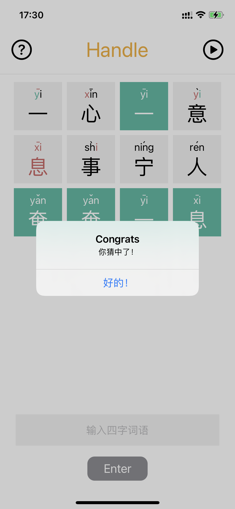

  <!-- img src="./public/left.PNG" width="351" height="759" --->
  

# Handle
A Chinese version of Wordle

## How To Play
Guess the 4-letter idiom in 10 tries.  
After each guess, the color of the character and pinyin would change to indicate how close you are to the answer. 

## Author
Yuheng Ding
d.yuheng@wustl.edu

## License
This project is licensed under the MIT License - see the LICENSE.md file for details

## Inspiration
* [Wordle](https://www.nytimes.com/games/wordle/index.html)
* [汉兜](https://handle.antfu.me)
